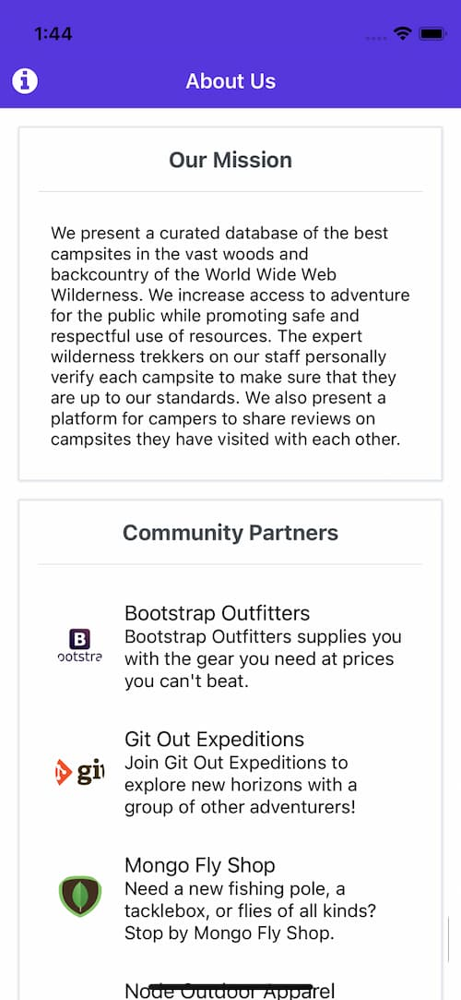

# Nucamp Site Mobile App
## Overview
A featured mobile app for virtual hiking courses. I made this app as a capstone for React Native course at the Nucamp Coding Bootcamp.
### Home and Menu

  

### User Register

 

### Comment, Like, and Favorite

### Reserve with Calendar

### Other Pages

   

## Development
### Languages and Framework
- React Native
- Expo

### Features
- Login
- Like the posts
- Swipe to like
- Reservation
- Create, read, update, delete and store comments
- Chage user picture
- OAuth

